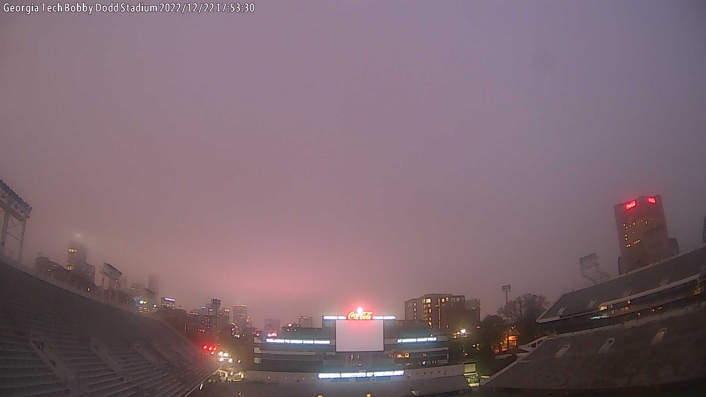

# gt-weather-data

Using the weather station located at the Georgia Tech campus, this project aims to collect and analyze weather data. The data is collected using the API publicly available from the [Weather Underground](https://www.wunderground.com/). This information can be further developed into a webapp to provide weather information to the Georgia Tech community, which is what this project aims to provide. The link is attached to the repository. 

## Packages used: 
pandas

requests

streamlit

## Images

## References
<https://github.com/hakancangunerli/UGAWeatherData>

<https://www.weatherstem.com/api_docs>
